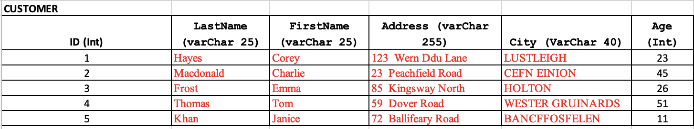

images
# **Assignment No. 1 - Logging and Rollback**

# **Description**
You are going to simulate a logging and rollback system for a simple database that encompasses individuals, their bank accounts and the balances of those accounts.

As we are focusing on the conceptual side, we will not be using MariaDB or any other RDBMS. After all, the latter include in their design this logging and rollback capabilities.

To simplify the problem, we will focus on the accounts of Emma Frost, BankID number = 3. Below an image of the CUSTOMER DB:

#**Transaction to be executed**
Emma will be moving $100,000 from her checking account (312345C) to her Savings Account (312345S).

BEFORE Transaction
Checking Balance = 786324
Savings Balance = 987613

AFTER Transaction
Checking Balance = 686324
Savings Balance = 1087613

It is important to understand that Emma's transaction is only one: transferring $100,000 from her Checking Account to her Savings Account. This is one logical transaction.

However, this transaction is divided into two different operations:
1. Updating Emma's balance for her Checking Account (subtracting the amount to be transferred out)
2. Updating Emma's balance for her Savings Account (adding to the balance the incoming money transfer)

For your simulation, Emma's transaction is satisfactorily completed ONLY when both operations (1 and 2) above are completed!

# **Simulation Requirements**
- Understanding whether your logging & rollback system is successful, will depend on 2 aspects:
1. The contents of your logging & rollback data structure
2. The status of the values for Checking & Savings of the balances relation (table)

Below the schemas for the ACCOUNT and ACCOUNT_BALANCE Relations (Tables):

- COMMIT: as we know, a COMMIT is the signal we send to the RDBMS, telling it that a logical-transaction has been executed successfully. Hence, it is time to make the changes made to the Database persistent (save them to secondary storage).

- In our simulation, Main_Memory corresponds to the data structure you are manipulating in your code to make a given  transaction happen.

- In our simulation, SECONDARY_MEMORY -the place where the data will be persisted- will be a file in your computer (you can assume that the structure of the file is a .csv file). The .csv files for your assignment will be provided to you, and they correspond to the Relations' images shown above.

- A successful transaction will show two things:
   1. Your .csv files (your Tables) should show the expected values after a successful transaction.
   2. Your Logging & Rollback Data Structure should show all transactions as completed -or should be EMPTY.

- An un-successful transaction will show two things:
   1. Your .csv files (your Tables) should show the updated values values (if an operation managed to get executed)
   2. Your Logging & Rollback Data Structure should show what transaction(s) would need to be reversed (roll-back).

You should print out the contents of your Logging & Rollback System as soon as an EXCEPTION is detected. If you prefer, you could make your data structure persistent by writing it to a file (this file MUST be different than the files that contain the Database Tables/Relations). The recommendation would be to use one file (.csv) per relation/table.

# **Starting Code for Main Program (in Python)**
A starting code written in Python is included in GitHub. Please notice that the transactions to the executed are randomly generated! Hence, if an exception would occur BEFORE you have managed to issue a COMMIT, your Database would most likely be in bad shape, and your Logging & Rollback Data Structure would be our only hope to restore your database to the proper level of integrity and stability.

# **Designing the Logging & Rollback Sub-system**
The design of the data structure -and its contents- for the Logging & Rollback sub-system is in your hands. You can choose any data structure that works for you. Having said that, the material covered in class -as well as the Class' Notes- should provide all the advice you need to design your solution.

# **Programming Language of Choice**
Please select your language among those listed below:
   - Python
   - Java
   - C/C++
